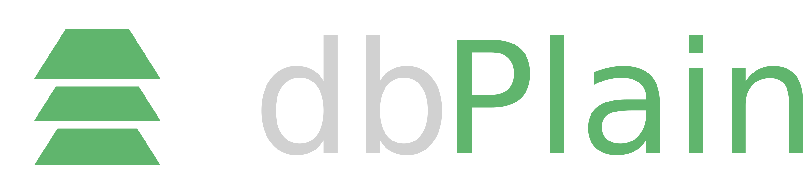
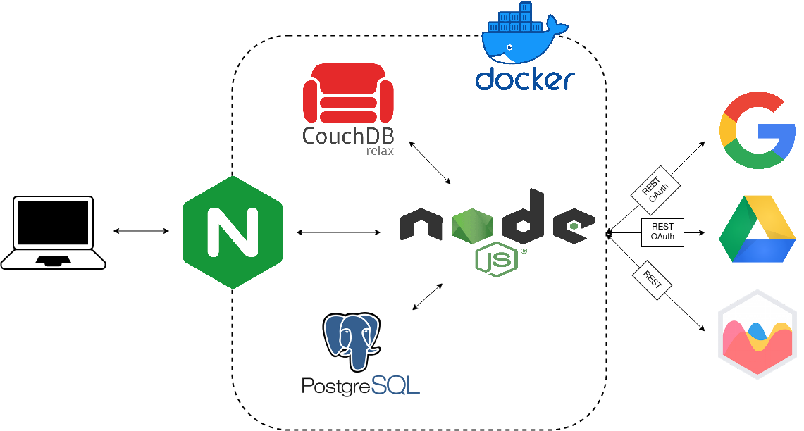

 

# SCOPO del progetto

### PERCHE' DBPLAIN?

> "Il 90% dei dati esistenti oggi è stato creato soltanto negli ultimi due anni. Ogni giorni produciamo 2,5 miliardi di miliardi di bytes" 

Partendo dalle evidenze statistiche sulla produzione dei dati negli ultimi anni, abbiamo riflettuto sul fatto che ormai, la gestione dei dati, non è più un'attività che possono fare solo pochi esperti, ma un lavoro che deve poter essere svolto in modo più semplice, veloce e da un maggior numero di persone.

### DESCRIZIONE DEL PROGETTO

L'applicazione si pone l'obiettivo di interporsi nella gestione tra utente e database, con lo scopo di facilitare e velocizzare i meccanismi di gestione di questi ultimi. 
In particolare l'applicazione consente di gestire più database in contemporanea, permettendo la visualizzazzione delle tabelle che ne fanno parte e il successivo inserimento/eliminazione dei dati a seconda della necessità dell'utente.

### POSSIBILI SVILUPPI FUTURI 

Per migliorare l'efficacia del prodotto, verrà implementata la possibilità di creare/eliminare tabelle tramite interfaccia, inoltre sarà possibile modificare le tabelle già esistenti e introdurre analisi di Data quality sui dati.
 Lo sviluppo più ambizioso sarà quello di implementare tutte queste funzionalità non solo per i DB relazionali ma anche per ulteriori fonti di dati(file json,file csv, file xml, database NoSql) e l'opportunità di interconnettere queste fonti in un unico database.

 

# ARCHITETTURA e TECNOLOGIE utilizzate

<picture>
  <source media="(prefers-color-scheme: dark)" srcset="schema.png">
  
</picture>

- Docker: utilizzato per creare l'ambiente di sviluppo dell'applicazione;
- nginx: web server che gestisce la parte statica dell'applicazione; 
- nodeJs: ambiente di runtime che abbiamo impiegato per creare la parte back-end dell'applicazione in javascript; 
- couchDb: database utilizzato per i dati utili al funzionamento dell'applicazione;
- postgres sql: database relazionali per simulare i DB dell'utente da gestire;
- bootstrap, jquery, ajax: librerie javascript e html/css che abbiamo adoperato lato client.

 

# REQUISITI

- API interne sono documentate e accessibili all'indirizzo `https://localhost:8083/apidoc` oppure in [questo file](server/public/apidoc/index.html).
- Il servizio si interfaccia con tre API REST di terze parti:
  - Google (API commerciale): come login e per interfacciarsi al servizio Google Drive (tramite OAuth2);
  - [Chartjs](https://www.chartjs.org/): per la costruzione di grafici.
- il progetto sviluppa delle websocket per lo scambio di dati con il server in particolare per la visualizzazione 
  delle tabelle tramite chart.js e nel servizio responsabile per l'insert di nuove righe,per svilupparlo abbiamo utilizzato la libreria socket.io
- CI/CD implementata tramite GitHub Action per unit tests, controllo delle performance (tramite Lighthouse fornito da Google) e controllo della security (in base alle vulnerabilità conosciute e a meccanismi di ML forniti da CodeQL) della web application.  
- Sicurezza: Il servizio è accessibile tramite protocollo SSL self-signed, l'input dell'utente è controllato e lo scambio con le API commerciali avviene fornendo un esplicito Nonce (creato con il pacchetto `crypto` di Nodejs) che viene controllato durante lo scambio.  

 

# Installazione e Test 

Prerequisiti: Docker, Docker-compose, Nodejs (e npm).

1. `git clone`
2. `cd dbPlain`
3. `npm ci`
4. per permettere una comunicazione sicura tramite protocollo SSL: creare dei certificati self-signed da inserire in `certs/` tramite i [seguenti comandi](https://github.com/ChimeraCoder/nginx-ssl-docker)
5. per usare le API di google: inserire i campi opportuni nel file `.env.sample` e ridenominare il file in `.env` 

Per avviare il progetto: `docker-compose up --build` [^shutdown]  
Il servizio è ora accessibile all'indirizzo `https://localhost:8083/static/`  

All'interno dell'applicazione è possibile registrarsi o fare il login; successivamente sarà possibile gestire il proprio database in modo grafico e con agevoli bottoni. Diverse funzioni per la gestione del db sono inoltre disponibili tramite API.  
Un database Postgres di prova è fornito dall'applicazione e accessibile all'indirizzo `http://localhost:8082/`: da qui è possibile verificare l'effettiva efficacia del servizio.     

[^shutdown]: Per fermare l'esecuzione: `docker-compose down` 